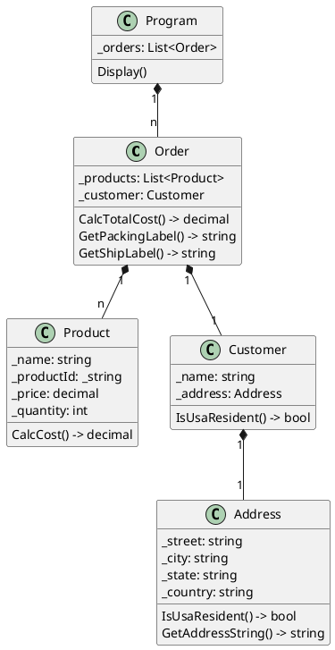

```plantuml
@startuml

class Order {
    _products: List<Product>
    _customer: Customer
    
    CalcTotalCost() -> decimal
    GetPackingLabel() -> string
    GetShipLabel() -> string
}

class Product {
    _name: string
    _productId: _string
    _price: decimal
    _quantity: int

    CalcCost() -> decimal
}

class Customer {
    _name: string
    _address: Address
    
    IsUsaResident() -> bool
}

class Address {
    _street: string
    _city: string
    _state: string
    _country: string
    
    IsUsaResident() -> bool
    GetAddressString() -> string
}

class Program {
    _orders: List<Order>
    
    Display()
}

Program "1"  *-- "n" Order
Order "1"  *-- "n" Product
Order "1"  *-- "1" Customer
Customer "1"  *-- "1" Address
@enduml
```
