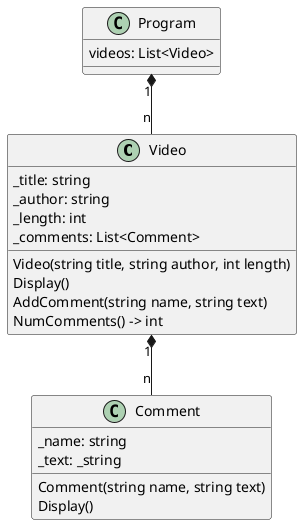

```plantuml
@startuml

class Video {
    _title: string
    _author: string
    _length: int
    _comments: List<Comment>
    
    Video(string title, string author, int length)
    Display()
    AddComment(string name, string text)
    NumComments() -> int
}

class Comment {
    _name: string
    _text: _string
    
    Comment(string name, string text)
    Display()
}

class Program {
    videos: List<Video>
}

Video "1"  *-- "n" Comment
Program "1"  *-- "n" Video
@enduml
```
